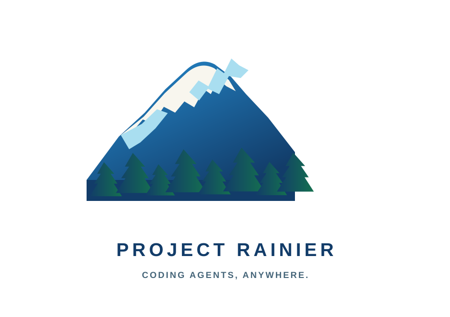

# Rainier

  

Self-hostable infrastructure for running your coding agents — Claude Code,
Codex, Gemini CLI, and friends — in your own cloud, while they feel like local
terminal sessions. Sessions survive laptop sleep and network changes; attach
shows the agent's real TUI from any machine; your subscriptions and your GitHub
identity stay yours.

Status: v0 design phase. See
[`docs/superpowers/specs/2026-08-27-rainier-design.md`](docs/superpowers/specs/2026-08-27-rainier-design.md).

License: [Apache-2.0](LICENSE)
