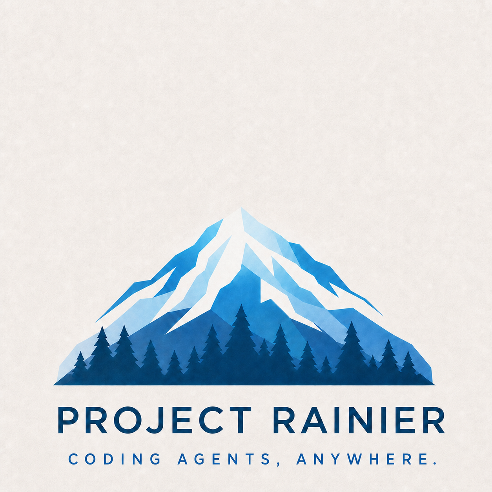

# Rainier

<p align="center">
  
</p>

Self-hostable infrastructure for running your coding agents — Claude Code,
Codex, Gemini CLI, and friends — in your own cloud, while they feel like local
terminal sessions. Sessions survive laptop sleep and network changes; attach
shows the agent's real TUI from any machine; your subscriptions and your GitHub
identity stay yours.

> **Active Development & Hosted Cloud Service Coming Soon:** Project Rainier is under active development. Alongside self-hosting, **a fully managed hosted cloud service is launching soon**. We are actively onboarding **pilot users, design partners, and collaborators** — reach out to **[josh@tokencanopy.com](mailto:josh@tokencanopy.com)** for early access.

## The Problem Rainier Solves

Autonomous coding agents (Claude Code, Codex, Gemini CLI, and others) are transforming software engineering, but running them on personal machines introduces significant friction:

- **Laptops sleep, agent runs break:** Long-running agent tasks abort when a developer closes their laptop lid, walks away, or changes Wi-Fi networks.
- **Remote shouldn't mean headless:** Traditional remote containers or batch jobs strip away the rich interactive terminal UI, making real-time steering and feedback difficult.
- **Credential sprawl & security risks:** Pasting personal GitHub PATs or cloud keys into `.git/config` or container environments creates security liabilities; unmonitored container networking risks accidental data exfiltration.
- **Local resource exhaustion:** Running multiple parallel agent sessions pegs CPU/memory, burns battery, and litters local working copies with half-finished branches and scratch files.

**Rainier solves this by providing persistent, secure cloud execution with a local-feeling terminal:**

- **Continuous Sessions:** Agents run on cloud sandboxes that survive laptop sleep, network drops, and machine transitions. Reconnecting instantly restores the interactive TUI.
- **Zero Credential Exposure:** GitHub tokens and secrets are vaulted in the control plane and minted per-git-operation via an in-sandbox helper — never written to disk or container volumes.
- **Locked-Down Egress:** Built-in network allowlisting restricts external network calls to approved endpoints and registries.
- **Parallel Scale:** Offload multiple agent sessions simultaneously without bogging down your workstation.

### Architecture & Status

Rainier is currently at **v0 (terminal happy path)**. One `controld` (Postgres-backed REST + WebSocket API, GitHub identity, least-loaded placement, credential vault) fronts N `runnerd` VMs that dial it outbound, and the `rainier` CLI drives the whole fleet. Sessions clone your repositories at boot and push back as you.

- **Deployment Guide:** [`docs/deploy-gce.md`](docs/deploy-gce.md)
- **Architecture Specs:**
  - [Rainier Overview](docs/superpowers/specs/2026-08-27-rainier-design.md)
  - [Control Plane (`controld`)](docs/superpowers/specs/2026-08-28-plan3-controld-design.md)
  - [Environments & Snapshots](docs/superpowers/specs/2026-08-29-plan4-environments-design.md)
  - [GitHub Connector & Credential Vault](docs/superpowers/specs/2026-08-29-plan5-github-vault-design.md)

## Quickstart

```bash
make build

# Point the CLI at your controld and log in with your GitHub identity.
# --from-gh borrows the token from the `gh` CLI; --token <t> and
# --client-id <id> (device flow) are the alternatives.
bin/rainier login --from-gh --server http://rainier-1:9090

bin/rainier new --name box1 --image rainier-session:latest   # creates, then attaches
bin/rainier ls                                               # id, name, env, state, runner, reachable, age
bin/rainier attach box1                                      # resumes if needed; Ctrl-] detaches
bin/rainier suspend box1 && bin/rainier resume box1
bin/rainier rm box1
```

`rainier new` attaches immediately by default so you watch the agent boot;
`--detach` opts out. `rainier attach` is state-aware: a suspended session is
resumed first, and an established viewer reconnects after transient network or
control-plane interruptions from the last terminal sequence it rendered.
Names are per-owner, so `<id|name>` takes either.

An **environment** is the reusable template a session starts from — a base
image, a setup script, an egress allowlist, and the team secrets its sessions
get as environment variables:

```bash
printf %s "$GH_PAT" | bin/rainier secret set GH_TOKEN   # write-only; stdin keeps it out of your history
bin/rainier env create dev --image node:22 \
  --setup-file ./setup.sh --secret-ref GH_TOKEN \
  --egress registry.npmjs.org,github.com
bin/rainier env ls                                      # name, id, image, cached
bin/rainier new --name box2 --env dev                   # ...starts from it
```

The first session on an environment runs the setup script live — attach and
you watch it — and its image is then snapshot-cached for the next one;
editing the image or the script invalidates that cache without touching any
running session. `--image`/`--egress` on `new` override the environment for
that one session. Setup scripts should install into image-visible paths —
`$HOME`, or `/opt/rainier-env` on the stock session image, which is already on
`PATH` — because that is what the snapshot carries forward, while `/workspace`
is a per-session volume the snapshot excludes. Details, including the one
hardening flag a first build trades away and why `/usr/local` is not the
install prefix, in [`docs/deploy-gce.md`](docs/deploy-gce.md) §7.

Give an environment a **github connector** and its sessions arrive with the
code already checked out, on a branch of their own, able to push:

```bash
bin/rainier login --from-gh --server http://rainier-1:9090  # asks for `repo`
bin/rainier creds                                           # provider, status, scopes
bin/rainier env create app --image node:22 \
  --connector-json '{"type":"github","repo":"acme/app"}' \
  --init-file ./init.sh                  # runs after the clone, on every boot
bin/rainier new --env app --name app1    # /workspace/app on branch rainier/app1
bin/rainier diff app1                    # per repo: this branch vs the base
bin/rainier push ./notes app1:/workspace/notes   # and `pull` the other way
```

Commits from inside a session are the human's: `user.name` is your GitHub
login and `user.email` your GitHub noreply address. The token behind them is
sealed in controld and minted **per git operation** through an in-sandbox
credential helper — it is never written to `.git/config`, an environment
variable, or the workspace volume. When it goes stale, one failed operation is
enough: `rainier creds` reads `needs_refresh` and both git and the API say
`rainier login --refresh github`. `setup` is the cacheable, pre-clone half
(toolchains); `init` is the per-boot, post-clone half (`npm ci` and friends),
and it runs on cache hits too. [`docs/deploy-gce.md`](docs/deploy-gce.md) §8
has the whole story.

Locally, `make e2e` brings the whole stack up on your own machine (Postgres in
docker; controld, egressd and a dial-mode runnerd on the host, with runnerd
driving real containers) and drives that same CLI flow end to end, secrets and
environments included — plus, when `gh` is authenticated with `repo` and
`delete_repo`, a real clone/commit/push against a throwaway private repo it
creates and deletes. The dress rehearsal for a real deploy.

## What runs where

| Component | Where | Talks to |
|---|---|---|
| `rainier` | your laptop | controld (HTTPS/WSS) |
| `controld` | one VM | Postgres; accepts runner and client connections |
| `runnerd` | each runner VM | dials controld outbound; drives docker |
| `egressd` | each runner VM | the session allowlist proxy (egress R4) |
| `sessiond` | inside each session container | dials its runnerd outbound |

Reachability is outbound-only in one direction (spec rule 3): sessiond →
runnerd → controld, and clients talk only to controld. Nothing dials into a
runner.

`runnerctl` and `rattach` are **dev tools**, not the product surface: they
drive one runnerd's local HTTP API directly, bypassing the control plane
(no identity, no placement, no durable state). They stay in-tree for
debugging a single box — `rainier` is the CLI to use.

## Tests

```bash
go test ./...                    # unit + contract suites (no services needed)
go test ./internal/e2e/ -race    # in-process e2e scenes: chaos, environments, git
make e2e                         # full stack on docker, driven by the real CLI
./scripts/egress-check.sh        # egress R4 acceptance (exit 3 = skipped on VM-backed docker)
```

The store contract suite runs against memstore by default and against
Postgres when docker is available; the e2e scenes take
`RAINIER_TEST_PG_DSN=postgres://…` to run the same scenarios against pgstore.

## Terminal latency benchmark

After `make build` and `rainier login`, the developer benchmark drives the real
configured fleet with sequential synthetic scratch sessions:

```bash
bin/rainier-latency --rainier bin/rainier --samples 10
bin/rainier-latency --rainier bin/rainier --samples 10 --cold
```

It performs one unreported warm-up by default, emits JSON Lines observations
and R-7 percentile summaries, and removes every session it creates. Output
contains no session identifiers, terminal contents, user identity, or runner
names. The warmed-fleet targets are p95 under 1.5 s for create-to-usable, 200 ms
for attach by id, 225 ms by name, and 75 ms for terminal interaction RTT.
These exclude image pulls, environment setup, agent CLI boot, burst load, and
geographic network differences; small `--samples` values make p95 directional.

## Hosted Pilot & Partnerships

A managed hosted cloud service of Project Rainier is launching soon. We are actively welcoming **pilot users, design partners, and collaborators**:

- **Engineering teams** looking to run persistent, off-laptop agent environments.
- **Developers** running multi-agent workflows across repositories without local resource drain.
- **Organizations** needing safe agent sandboxes with vaulted credentials and egress filtering.

To join the pilot program or discuss partnerships, email **[josh@tokencanopy.com](mailto:josh@tokencanopy.com)**.

## License

[Apache-2.0](LICENSE)
