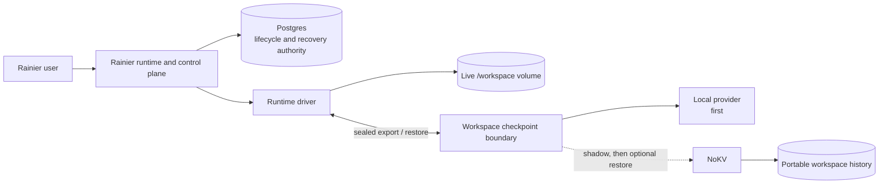

# RFC: Rainier and NoKV workspace continuity

**Date:** 2026-08-29

**Last updated:** 2026-08-31

**Status:** High-level proposal for discussion

**Audience:** Rainier owners and maintainers

## Summary

Rainier already preserves a session's `/workspace` volume across a container
crash or cold park on the same runner. Its v0 design explicitly accepts that
unpushed work is lost with the runner VM, while the v1 roadmap calls for
object-storage checkpoints and automatic recovery on another runner.

This proposal offers a narrow collaboration path for that existing v1 goal.
Rainier and Postgres keep lifecycle authority; Rainier's runtime driver seals
and installs workspace data; a replaceable checkpoint provider stores durable
versions. A local provider comes first, with NoKV evaluated later.

The user outcome is that Rainier can recreate uncommitted code, generated files,
tool outputs, and other workspace state on another runner, then let the agent
continue through its native session-resume mechanism. It does not preserve the
original process, terminal, network connections, or memory.

Git session branches and Rainier's manual `push`/`pull` already protect
deliberately transferred work. The remaining gap is automatic recovery of
unpushed, generated, and multi-repository workspace state after runner loss.

Because Rainier is currently focused on its v0 runtime and control-plane path,
the right contribution now is a clean boundary and shared qualification
work—not a remote NoKV dependency in the critical path.

## Collaboration boundary

| Owner | Responsibility |
|---|---|
| Rainier | live workspace, session lifecycle, runner placement, and selecting a recovery point |
| Postgres | durable Rainier control state |
| Runtime driver | safely export a stable workspace and install it into a new runtime |
| Checkpoint provider | store durable workspace versions and manage history and cleanup |
| NoKV | an optional checkpoint and provenance provider behind the Rainier boundary |

NoKV would not become Rainier's scheduler, control plane, live filesystem, or
process-snapshot system. This follows the NoKV and LoopX direction: the
application keeps semantic authority while NoKV provides the durable workspace
and artifact layer beneath it.

The proposal complements Rainier's existing image snapshot support. Environment
images capture reusable runtime setup, while the per-session `/workspace`
volume carries user work and needs its own portable durability path.

## What we can provide now

We can help without changing Rainier's current v0 lifecycle:

1. **Boundary and tests:** separate driver-owned export/install from
   provider-owned history, then hold every provider to shared recovery,
   retention, and cleanup expectations.
2. **Lifecycle and E2E support:** define checkpoint contents and capture timing,
   reuse Rainier's existing path-safety rules, and test runner loss and restore
   through the real runtime path.
3. **A shadow NoKV adapter:** when Rainier is ready, compare NoKV with the local
   result and measure reliability, latency, and storage cost without affecting
   sessions.
4. **Upstream NoKV support:** fix missing integration or lifecycle capabilities
   in NoKV instead of hiding them in Rainier-specific glue.

An exploratory local prototype and cross-project tests informed this proposal.
They are deliberately not part of this high-level RFC: the first code change
should follow the runtime boundary agreed with Rainier's owner.

## The capability that is difficult to replace

No individual NoKV primitive is unique. Rainier could combine Postgres and
object storage, use snapshots, or adopt a managed sandbox. The harder-to-replace
capability is the complete agent-workspace model:

> One portable identity for a workspace across publication, retry, recovery,
> history, provenance, retention, and safe reclamation—independent of the
> runner, VM, container, or sandbox provider.

Rainier can build this composition itself, but would then own the consistency
rules connecting Postgres, object storage, recovery jobs, lineage, and garbage
collection. NoKV's defensible value is reducing that correctness surface while
keeping Rainier's control plane independent—not an irreplaceable storage
primitive, but an integrated lifecycle that is not cheaply replaced.

## Benefits and costs

Benefits:

- less recovery, history, provenance, and cleanup machinery for Rainier to own;
- workspace portability across runner and runtime implementations;
- a common foundation for future restore, fork, handoff, and audit use cases;
- a shadow-first path that does not disrupt Rainier's current development.

Costs and limits:

- NoKV adds metadata and object-storage operations beside Postgres;
- Rainier's v0 deliberately has one stateful control service, so NoKV belongs
  to an optional post-v0 evaluation rather than the current critical path;
- the first Go-to-NoKV integration surface still needs to be built;
- workspace capture adds latency, I/O, and storage consumption;
- NoKV remote high availability and long-horizon recovery need more
  qualification;
- NoKV does not preserve process memory, terminals, sockets, or GPU state.

## Suggested roadmap

| Stage | Joint outcome | Safety boundary |
|---|---|---|
| Now | agree on the driver/provider boundary and acceptance criteria | RFC only; no NoKV runtime dependency |
| Local continuity | export a stable `/workspace`, remove its runtime, and install it on another runner | Rainier owns export and installation |
| NoKV shadow | publish the same workspace to NoKV and compare correctness and cost | NoKV failure cannot affect sessions |
| Optional restore | allow selected users to restore from qualified NoKV history | Postgres still selects the recovery point |
| Production consideration | qualify multi-runner recovery, availability, retention, and rollback | promotion requires a separate owner decision |

Future collaboration may extend from checkpoint and restore into workspace fork,
handoff, long-term provenance queries, and reference-aware cleanup. Each step
remains optional and evidence-gated.

## Explicit non-goals

This proposal does not:

- replace Postgres or make NoKV Rainier's control plane;
- give NoKV responsibility for scheduling, runner placement, or session
  lifecycle;
- put NoKV on create, attach, suspend, or terminal paths today;
- provide live process migration;
- claim that the current prototype is production-ready;
- require Rainier to choose NoKV after the shadow evaluation.

## Current confidence

The exploration has exercised NoKV's workspace flow, relevant LoopX provider
behavior, and a Rainier-shaped publish and restore scenario. Rainier's current
main was also reviewed against this proposal.

This is enough evidence to discuss the collaboration, but not enough to claim a
Rainier runtime integration, two-runner failover, or authoritative NoKV
recovery. Those require a follow-up design and E2E through Rainier's real driver
and `/workspace` volume.

## Decision requested

Rainier owners are asked whether they agree with:

1. treating workspace continuity separately from process continuity;
2. adding a provider-neutral workspace checkpoint boundary;
3. making the first implementation contribution a driver-owned export/install
   seam plus shared contract tests;
4. keeping Postgres as Rainier's sole control-state authority;
5. evaluating NoKV later through non-authoritative shadow publication.

If agreed, the next joint step is a small implementation plan for the local
driver seam and E2E. No NoKV production wiring is required by this RFC.

## References

- [Rainier v1 durability roadmap](./2026-08-27-rainier-design.md#12-v1-roadmap)
- [LoopX shared-goal authority RFC](https://github.com/huangruiteng/loopx/blob/main/docs/architecture/rfcs/shared-goal-authority-state-provider-v0.md)
- [LoopX PR #2787](https://github.com/huangruiteng/loopx/pull/2787)
- [NoKV PR #423](https://github.com/NoKV-Lab/NoKV/pull/423)
